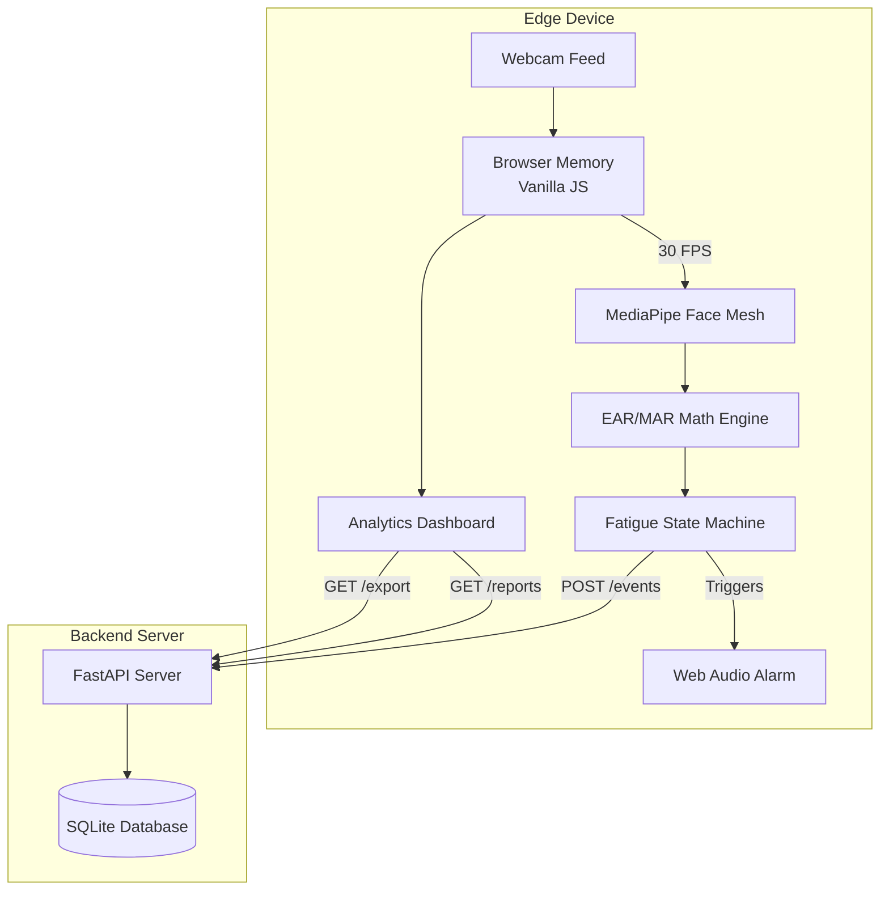

# VigilEdge AI — Zero-Training, CPU-Optimized Driver Fatigue Monitor

A real-time, edge-computing driver fatigue monitoring system that runs entirely in the browser using MediaPipe Face Mesh and a Python FastAPI backend for event logging and reporting.

---

## 🏗️ Architecture

```
vigiledge-ai/
├── backend/                 # Python FastAPI backend
│   ├── main.py              # FastAPI app, routes, static serving
│   ├── models.py            # SQLAlchemy ORM models (Session, FatigueEvent)
│   ├── database.py          # SQLite connection & session management
│   ├── requirements.txt     # Python dependencies
│   └── venv/                # Python virtual environment
│
└── frontend/                # Vanilla HTML/CSS/JS frontend
    ├── index.html           # Main HUD with webcam & fatigue monitoring
    ├── style.css            # Premium dark-theme glassmorphic design
    ├── main.js              # MediaPipe Face Mesh + fatigue state machine
    ├── dashboard.html       # Post-trip incident reporting dashboard
    ├── dashboard.css        # Dashboard-specific styles
    └── dashboard.js         # Dashboard data fetching & rendering
```

### Data Flow Architecture



---

## ⚡ Quick Start

### Prerequisites

- **Python 3.8+** installed
- A **webcam** (built-in laptop camera works)
- A modern browser (Chrome, Edge, Firefox)

### 1. Clone / Navigate to the project

```bash
cd vigiledge-ai
```

### 2. Set up the Python backend

```bash
# Create and activate the virtual environment (if not already done)
python3 -m venv backend/venv
source backend/venv/bin/activate      # Linux/macOS
# backend\venv\Scripts\activate       # Windows

# Install dependencies
pip install -r backend/requirements.txt
```

### 3. Start the server

```bash
cd backend
../backend/venv/bin/uvicorn main:app --reload --host 0.0.0.0 --port 8000
```

### 4. Open in browser

Navigate to **http://localhost:8000** in your browser.

- Click **"Start Monitoring"** to begin.
- The system will calibrate for 3 seconds — look straight ahead.
- Close your eyes for ~1.5s to trigger a drowsiness alert.
- Open your mouth wide to trigger a yawn detection.
- Click **"Dashboard"** in the top-right to view logged events.

---

## 🔑 Key Features

| Feature | Description |
|---|---|
| **Dynamic Auto-Calibration** | 3-second face scan establishes personalized EAR/MAR baselines — works for all eye shapes, glasses, makeup |
| **Fatigue State Machine** | Rolling fatigue score avoids false alarms from normal blinks |
| **Multi-Metric (EAR + MAR)** | Simultaneously tracks eye closure (micro-sleeps) and yawning |
| **Async Audio Alarm** | Web Audio API alarm loops without blocking the video pipeline |
| **Real-Time HUD** | Live telemetry (EAR, MAR, FPS, Fatigue Bar) overlaid on the webcam feed |
| **Incident Logging** | Events persisted to SQLite via REST API |
| **Reporting Dashboard** | Post-trip analysis with severity breakdown and event timeline |
| **100% Edge / CPU** | No GPU, no cloud — runs on any laptop at 30 FPS |

---

## 🔌 API Endpoints

| Method | Endpoint | Description |
|---|---|---|
| `POST` | `/api/sessions` | Start a new monitoring session |
| `GET` | `/api/sessions` | List recent sessions |
| `PATCH` | `/api/sessions/{id}/end` | End a session |
| `POST` | `/api/events` | Log a fatigue event |
| `GET` | `/api/sessions/{id}/events` | Get events for a session |
| `GET` | `/api/reports/summary` | Aggregate statistics & timeline |
| `GET` | `/api/health` | Health check |

---

## 🧪 Tech Stack

- **Frontend**: Vanilla HTML/CSS/JS, Google MediaPipe Face Mesh (CDN)
- **Backend**: Python 3, FastAPI, SQLAlchemy, SQLite
- **Design**: Glassmorphism, Inter + JetBrains Mono fonts, CSS animations
