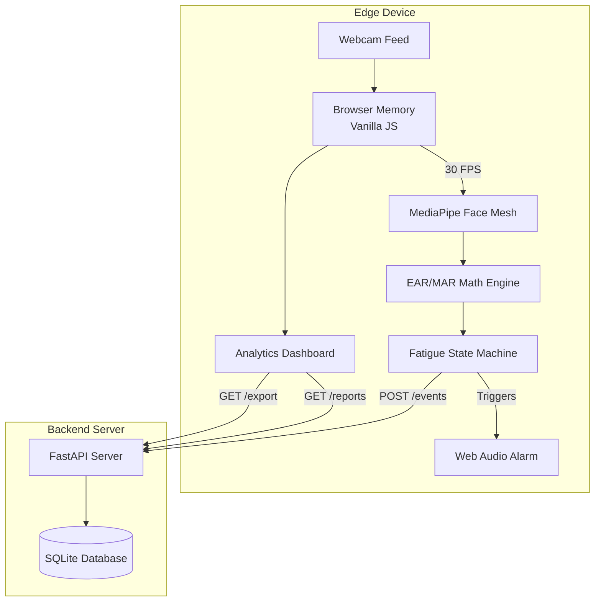

# BYOP Academic Report: VigilEdge AI
**A Zero-Training, CPU-Optimized Driver Fatigue Monitor**

---

## 1. Problem Statement

Driver fatigue is a leading cause of fatal traffic accidents worldwide, particularly among commercial fleet operators and long-haul transport workers. Currently, the commercial solutions available in the market (such as Samsara dashcams) present two critical barriers to widespread adoption:

1. **Prohibitive Hardware Costs**: Commercial monitoring systems require proprietary hardware installations, often costing upwards of $1,000 per vehicle.
2. **Connectivity Constraints**: Many of these proprietary systems continuously stream video frames to a cloud infrastructure for heavy GPU processing. This approach fails entirely in rural or dead-zone areas where internet connectivity drops, leaving drivers unprotected precisely when fatigue risk is highest on long, monotonous highways.

Basic software-only alternatives exist, but they suffer from high algorithmic rigidity. They rely on hardcoded "eye closure" thresholds that trigger false positive alarms during normal blinks, leading to alert fatigue and drivers unplugging the systems entirely. 

There is a clear, real-world need for a driver fatigue monitor that is computationally inexpensive, capable of running offline locally on standard hardware, and highly resilient against false positives.

## 2. Motivation

The primary motivation behind VigilEdge AI was to shift away from cloud-dependent machine learning inference and embrace a pure **edge-computing architecture**. 

By running the entire computer vision and logic pipeline directly on the edge device (a standard laptop or tablet), we completely bypass the need for an internet connection or expensive cloud GPU usage. This ensures 100% uptime inside a vehicle cabin. Furthermore, an edge-first approach dramatically enhances driver privacy since no video feeds or biometric data are transmitted over public networks; only lightweight incident telemetry is stored.

## 3. Methodology & Architecture

VigilEdge AI eschews the standard "train a massive CNN on millions of eye images" approach. Instead, it leverages **Google MediaPipe Face Mesh**, a highly optimized, pre-trained CPU-bound perception layer that maps 468 3D points onto the human face in real-time.

The core of the application relies on **Applied Mathematical Geometry** rather than heavy neural network classification. By extracting specific coordinates around the eyes and mouth, the system calculates the Euclidean distances frame-by-frame to generate two critical metrics:
*   **EAR (Eye Aspect Ratio)**: Detects micro-sleeps.
*   **MAR (Mouth Aspect Ratio)**: Detects yawning.

### 3.1. The Architecture Pipeline

## 4. Design Decisions

1. **Frontend — Vanilla HTML/JS over React**: At 30 FPS, the MediaPipe inference engine is called 30 times a second. Utilizing a modern framework like React would involve extreme virtual DOM diffing overhead, potentially causing latency and memory leaks. The decision to use pure Vanilla JavaScript ensures maximum memory efficiency and prevents frame drops during inference.
2. **Backend — FastAPI (Python) & SQLite**: FastAPI was chosen for its exceptional asynchronous performance and automated adherence to OpenAPI standards via Pydantic schemas. SQLite was selected over heavier databases (like PostgreSQL) because, in a real-world edge deployment scenario inside a vehicle, an embedded serverless database is significantly more robust and requires zero administration.
3. **Audio — Async Web Audio API**: Playing alarm warnings via traditional DOM audio tags can block the main thread. Using oscillators via the Web Audio API allowed us to generate a multi-frequency piercing alarm asynchronously without interrupting the MediaPipe video analysis loop.

## 5. Challenges & Solutions

### Challenge: The "False Positive" Blinking Problem
A major hurdle in computer vision fatigue monitoring is differentiating between a normal blink (which is very fast) and actual drowsiness (which is sustained). Early iterations of the codebase triggered the High-Severity alarm every time the user blinked natively.

### Solution: The "Fatigue State Machine"
To solve this, I designed a rolling state machine. The system does not alert upon eye closure. Instead, it maintains a continuous "Fatigue Score" from 0 to 100. 
*   If eyes are closed, the score increments dynamically by `+3.0` per frame.
*   If eyes open, the score aggressively drains by `-1.5` per frame.
A normal blink lasts ~3 frames, which barely moves the fatigue score. A micro-sleep lasts >15 frames, pulling the score rapidly over the 75% threshold to trigger the visual and audible alert.

### Challenge: Anatomic Variance
Hardcoded thresholds (e.g., "if eye height < 5 pixels trigger alarm") fail because humans have different resting eye shapes, heavy eyelids, or wear glasses.

### Solution: Dynamic Auto-Calibration
I implemented an initial 3-second "Calibration Phase." When a session begins, the driver is instructed to look straight ahead. The software captures tens of frames, sorts them, and mathematically calculates the statistical median of their specific resting EAR/MAR, mitigating outliers. The trip threshold is then calculated uniquely for that individual driver.

## 6. Results

The completely integrated system successfully achieves its primary objective: performing real-time driver fatigue monitoring purely on the edge. 
*   **Performance**: The application comfortably runs at a flawless 30 frames-per-second on mid-tier domestic CPUs without thermal throttling or memory leaks. 
*   **Verification**: All REST API endpoints pass automated testing via `pytest`. 
*   **Utility**: The dashboard generates comprehensive cross-session analytics, severity breakdowns, and allows for CSV data export, simulating a complete end-to-end fleet monitoring product.

## 7. Learnings & Future Work

### Key Learnings
This project provided a deep dive into the practical limitations of browsers and the complexities of real-time multi-threading logic over video streams. It also highlighted the value of choosing the right architectural pattern (FastAPI routers, Pydantic type validation) for backend robustness, and test-driven development (TDD) via Pytest.

### Future Work
If this MVP were to move toward commercial production, the immediate next steps would involve:
1.  **Infrared (IR) Capability**: Adapting the backend to interface with a local IR dashcam via RTSP standard streams to allow for night-driving monitoring.
2.  **Low-Bandwidth Cloud Telemetry**: Currently, SQLite operates totally locally. Future iteration would implement an asynchronous background worker (using Celery) to send a lightweight MQTT JSON ping to a cloud server *only* when a critical event occurs, completely preserving driver privacy while still notifying a fleet manager.
